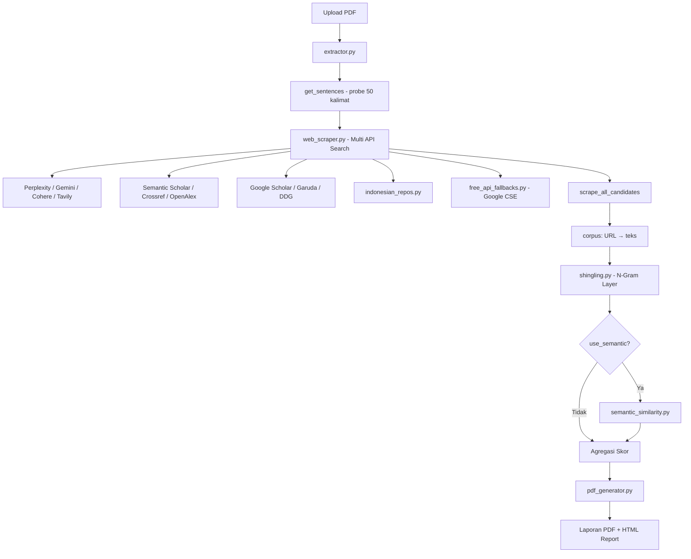

# Audit Lengkap — Plagiarism Checker (Turnitin Clone)

| Field | Value |
|-------|-------|
| **Tanggal Audit** | 13 Juli 2026 |
| **Versi Modul** | v2.1 (README) |
| **Auditor** | AI Code Review (sesi Cursor) |
| **Lingkup** | Seluruh kode & logika di folder `plagiarism_checker/` |
| **Tujuan** | Menilai kecacatan logika, kemampuan deteksi plagiarisme, dan reliabilitas pengambilan database jurnal dari internet |

---

> **STATUS PASCA-PERBAIKAN (Update Tahap 4 - Selesai):**
> 
> Keseluruhan masalah kritis dan mayor (*P0, P1, P2*) yang ditemukan pada audit ini telah **dituntaskan** di dalam basis kode, meliputi perbaikan:
> - Penyatuan logika Semantic Multilingual (`LOG-05`) dengan threshold aman `0.88`.
> - Keamanan API keys (*Fail Fast* tanpa default fallback) dan implementasi `.env` (`SEC-01`, `SEC-02`).
> - Koreksi algoritma *Word Offsets Mapping* untuk PDF tanpa tanda titik standar (`LOG-02`).
> - Pembersihan *Double Counting Semantic* (`LOG-12`) dan `exclude_small` yang presisi (`LOG-07`).
> - Perbaikan parsial URL Abstrak OpenAlex & Google CSE ke dalam Preloaded Corpus (`JRN-01`, `JRN-08`).
>
> *(Sisa Backlog P3 seperti limitasi rate, OCR, selector rapuh, dicatat sebagai expected limitation).*

---

## Daftar Isi

1. [Ringkasan Eksekutif](#1-ringkasan-eksekutif)
2. [Metodologi Audit](#2-metodologi-audit)
3. [Arsitektur Sistem](#3-arsitektur-sistem)
4. [Inventaris File & Dependensi](#4-inventaris-file--dependensi)
5. [Temuan Keamanan](#5-temuan-keamanan)
6. [Temuan Logika Deteksi Plagiarisme](#6-temuan-logika-deteksi-plagiarisme)
7. [Temuan Pengambilan Database Jurnal](#7-temuan-pengambilan-database-jurnal)
8. [Temuan Modul Pendukung](#8-temuan-modul-pendukung)
9. [Temuan UI/UX & API Server](#9-temuan-uiux--api-server)
10. [Perbandingan vs Turnitin Asli](#10-perbandingan-vs-turnitin-asli)
11. [Matriks Risiko](#11-matriks-risiko)
12. [Rekomendasi Perbaikan](#12-rekomendasi-perbaikan)
13. [Lampiran](#13-lampiran)

---

## 1. Ringkasan Eksekutif

Modul `plagiarism_checker` adalah aplikasi Flask lokal yang meniru alur kerja Turnitin: unggah PDF skripsi, cari sumber di internet/repositori akademik, bandingkan dengan algoritma N-Gram Shingling (5 kata), opsional semantic similarity, lalu hasilkan laporan PDF bergaya Originality Report.

### Kesimpulan Utama

| Aspek | Penilaian | Keterangan |
|-------|-----------|------------|
| **Arsitektur konseptual** | Baik | Pipeline hybrid (search → scrape → compare) masuk akal untuk pre-check |
| **Algoritma N-Gram lokal** | Cukup | Exact 5-gram + gap filling mirip Turnitin, tapi tidak fuzzy |
| **Semantic layer** | Lemah untuk BI | Model English-centric; threshold tetap 0.75 |
| **Pengambilan jurnal** | Tidak andal | Terlalu banyak API berbayar; error di-silent; bug pairing URL-teks |
| **Keamanan** | Buruk | API key hardcoded; debug mode; ngrok publik tanpa auth |
| **Kesiapan produksi** | Belum layak | Cocok sebagai eksperimen/pre-check, bukan pengganti Turnitin |

### Statistik Temuan

| Severity | Jumlah | Contoh |
|----------|--------|--------|
| **Kritis** | 4 | API key exposed, URL-teks misalignment, skor global top-20 only |
| **Mayor** | 11 | N-Gram non-fuzzy, repo Indonesia rapuh, OpenAlex tanpa teks |
| **Moderat** | 9 | PDF scan tidak didukung, exclude_small inkonsisten |
| **Minor** | 6 | UI terima .docx tapi server tolak, math.floor skor |

**Rekomendasi segera:** Perbaiki 4 temuan kritis sebelum digunakan untuk validasi akademik apa pun.

---

## 2. Metodologi Audit

### 2.1 File yang Diaudit

Semua file sumber Python, template HTML, konfigurasi, dan dokumentasi di:

```
plagiarism_checker/
├── app/server.py
├── app/engine/
│   ├── extractor.py
│   ├── shingling.py
│   ├── semantic_similarity.py
│   ├── web_scraper.py
│   ├── indonesian_repos.py
│   ├── free_api_fallbacks.py
│   └── pdf_generator.py
├── app/templates/index.html, report.html
├── requirements.txt
├── README.md
└── SETUP_GOOGLE_API.md
```

### 2.2 Metode

1. **Static code review** — tracing alur data dari upload hingga laporan
2. **Analisis logika algoritma** — verifikasi perhitungan skor, deduplikasi, edge cases
3. **Analisis integrasi eksternal** — evaluasi 12+ sumber API/scrape
4. **Cross-reference dokumentasi** — bandingkan klaim README vs implementasi aktual

### 2.3 Batasan Audit

- Tidak ada pengujian runtime/end-to-end terhadap PDF nyata
- Tidak ada pengukuran akurasi kuantitatif (precision/recall) terhadap ground truth
- Quota API pihak ketiga tidak diverifikasi aktif/expired

---

## 3. Arsitektur Sistem

### 3.1 Diagram Alur



### 3.2 Komponen Inti

| Modul | Peran | Input | Output |
|-------|-------|-------|--------|
| `server.py` | Flask API, session, threading | PDF upload | `file_id`, status, report |
| `extractor.py` | Ekstrak & bersihkan teks PDF | File PDF | `doc_text`, warnings manipulasi |
| `web_scraper.py` | Cari & unduh sumber web | 50 probe kalimat | `urls[]`, `preloaded_corpus{}` |
| `shingling.py` | Hitung kemiripan N-Gram | `doc_text`, `corpus` | skor %, sumber, frasa plagiat |
| `semantic_similarity.py` | Deteksi parafrasa | kalimat unmatched | cosine similarity matrix |
| `pdf_generator.py` | Highlight + halaman report | PDF asli + data | PDF laporan Turnitin-style |

### 3.3 Model Data

```python
# Hasil akhir per dokumen (results_db[file_id]['data'])
{
    'filename': str,
    'total_similarity': int,          # math.floor, bukan round
    'sources': [                      # max 20, sorted by percentage
        {
            'percentage': float,
            'matched_words': int,
            'url': str,               # domain, bukan URL penuh
            'sort_score': float,
            'detection_method': str   # opsional: 'semantic'
        }
    ],
    'plagiarized_sentences': [
        {
            'text': str,
            'source_id': int,
            'detection_method': str,  # opsional
            'similarity_score': float,
            'matched_source': str,
            'matched_text': str
        }
    ],
    'manipulation_warnings': [str]
}
```

---

## 4. Inventaris File & Dependensi

### 4.1 Dependensi Python (`requirements.txt`)

| Paket | Versi Min | Digunakan Untuk |
|-------|-----------|-----------------|
| flask | 2.3.0 | Web server |
| PyMuPDF (fitz) | 1.23.0 | Ekstrak PDF |
| beautifulsoup4 | 4.12.0 | Parse HTML |
| requests | 2.31.0 | HTTP client |
| reportlab | 4.0.0 | *(terdaftar, tidak dipakai di engine)* |
| duckduckgo-search | 3.9.0 | Pencarian web |
| sentence-transformers | 2.7.0 | Semantic layer |
| chardet | 5.2.0 | Deteksi encoding TXT |

**Dependensi implisit (tidak di requirements.txt):** `google-genai`, `pyngrok`, `torch`, `numpy`

### 4.2 Sumber Eksternal yang Dipanggil

| # | Layanan | File | Tipe | Status Risiko |
|---|---------|------|------|---------------|
| 1 | Perplexity AI | web_scraper.py | Berbayar | Key hardcoded |
| 2 | Google Gemini (5 keys) | web_scraper.py | Berbayar/Free tier | Key hardcoded |
| 3 | Cohere AI | web_scraper.py | Berbayar | Key hardcoded |
| 4 | Tavily AI | web_scraper.py | Berbayar | Key hardcoded |
| 5 | Semantic Scholar API | web_scraper.py | Gratis (rate limit) | Relatif aman |
| 6 | Crossref API | web_scraper.py | Gratis | Relatif aman |
| 7 | OpenAlex API | web_scraper.py | Gratis | Abstrak tidak diekstrak |
| 8 | ScrapingBee | web_scraper.py | Berbayar | Key hardcoded |
| 9 | ScraperAPI | web_scraper.py | Berbayar | Key hardcoded |
| 10 | AbstractAPI | web_scraper.py | Berbayar | Key hardcoded |
| 11 | Google Custom Search | free_api_fallbacks.py | Gratis 100/hari* | Key hardcoded |
| 12 | DuckDuckGo (DDGS) | web_scraper.py, free_api_fallbacks.py | Gratis | Import inkonsisten |
| 13 | Repositori ID langsung | indonesian_repos.py | Scrape langsung | Rapuh |
| 14 | Ngrok | server.py | Tunnel publik | Auto-expose tanpa auth |

*Catatan: README menyebut 10.000 queries/day; SETUP_GOOGLE_API.md menyebut 100/day — dokumentasi internal tidak konsisten.

---

## 5. Temuan Keamanan

### SEC-01 [KRITIS] API Key Hardcoded di Source Code

**Lokasi:** `web_scraper.py` (baris ~110, 150, 184, 382, 404–409, 440, 464, 533), `free_api_fallbacks.py` (baris ~209–213)

**Deskripsi:** Minimal 15+ kredensial API (Perplexity, Gemini×5, Cohere, Tavily, ScrapingBee, ScraperAPI, AbstractAPI, Google CSE×2, CX ID) tertanam langsung di kode sumber.

**Dampak:**
- Key dapat disalahgunakan pihak ketiga jika repo di-push ke GitHub publik
- Quota habis → seluruh pipeline search gagal diam-diam
- Biaya tak terduga pada layanan berbayar

**Rekomendasi:**
```python
# Gunakan environment variables
import os
SCRAPINGBEE_KEY = os.environ.get('SCRAPINGBEE_KEY')
GOOGLE_API_KEYS = os.environ.get('GOOGLE_API_KEYS', '').split(',')
```
- Rotate semua key yang sudah ter-expose
- Tambahkan `.env` ke `.gitignore` (saat ini hanya `.venv/`, `uploads/`, `reports/`)

---

### SEC-02 [MAYOR] Flask Debug Mode di Production

**Lokasi:** `server.py` baris 244

```python
app.run(host='0.0.0.0', port=5001, debug=True, use_reloader=False)
```

**Dampak:** Stack trace terpapar ke client; potensi remote code execution via Werkzeug debugger.

---

### SEC-03 [MAYOR] Ngrok Auto-Expose Tanpa Autentikasi

**Lokasi:** `server.py` baris 228–241

Server otomatis membuka tunnel publik ngrok ke port 5001. Siapa pun dengan URL ngrok dapat mengakses upload endpoint.

**Dampak:** Dokumen skripsi dapat diunggah/diintrospeksi oleh pihak tidak berwenang.

---

### SEC-04 [MODERAT] SSL Verification Disabled

**Lokasi:** `web_scraper.py`, `indonesian_repos.py` — `verify=False` di banyak `requests.get()`

**Dampak:** Rentan man-in-the-middle; konten sumber tidak terpercaya.

---

### SEC-05 [MODERAT] Hasil & Upload Tidak Dibersihkan

**Lokasi:** `server.py` — `results_db` in-memory; file di `uploads/` dan `reports/` tidak pernah dihapus.

**Dampak:** Disk penuh; data skripsi menumpuk di server lokal.

---

### SEC-06 [POSITIF] Session Ownership Validation

**Lokasi:** `server.py` — endpoint `/status`, `/report`, `/download`

Implementasi UUID `file_id` + validasi `session_id` sudah benar. Unauthorized access mengembalikan 403.

---

## 6. Temuan Logika Deteksi Plagiarisme

### LOG-01 [KRITIS] Skor Global Hanya dari 20 Sumber Teratas

**Lokasi:** `shingling.py` baris 107–113

```python
top_sources = sorted_sources[:20]
global_overlap_ngrams = set()
for s in top_sources:
    global_overlap_ngrams.update(s['overlap_ngrams'])
```

**Masalah:** *Similarity Index* total dihitung hanya dari overlap N-Gram 20 sumber ranking tertinggi. Plagiarisme dari sumber ke-21+ tidak masuk skor global meskipun terdeteksi di perhitungan per-sumber.

**Dampak:** Skor total **underestimate** jika banyak sumber kecil berkontribusi.

**Perbaikan:** Agregasi `global_overlap_ngrams` dari **semua** sumber di `sources_report`, bukan hanya `top_sources`.

---

### LOG-02 [KRITIS] Posisi Kata Semantic Layer Tidak Selaras

**Lokasi:** `shingling.py` baris 189–213 vs 117–125

**Masalah:**
1. `is_matched_global` dibangun dari `doc_words = doc_text.split()`
2. Posisi kalimat untuk semantic dihitung dengan menjumlahkan `len(sentence.split())` dari `doc_sentences`
3. `get_sentences()` di `shingling.py` (min 3 kata) ≠ `get_sentences()` di `extractor.py` (min 5 kata)
4. Pemisahan kalimat `re.split(r'(?<=[.!?]) +', text)` tidak identik dengan tokenisasi `split()` — spasi ganda, newline, dan tanda baca menciptakan offset

**Dampak:**
- Kata yang ditandai semantic bisa salah posisi
- Potensi double counting atau under-counting pada kalimat tertentu

**Perbaikan:** Bangun mapping kalimat→indeks kata langsung dari `doc_text` dengan satu fungsi `get_sentences` terpusat.

---

### LOG-03 [MAYOR] N-Gram Exact Match — Bukan Fuzzy

**Lokasi:** `shingling.py` baris 74–78, 121–125

**Masalah:** README v2.0 mengklaim *"Fuzzy Search (BM25) ... Strict Local N-Gram"*, tetapi pencarian web saja yang fuzzy. Perbandingan lokal adalah **exact 5-gram** setelah `re.sub(r'[^\w\s]', '', text)`.

**Dampak tidak terdeteksi:**
- OCR error (spasi hilang, huruf salah)
- Variasi tanda baca/hyphenation
- Sinonim dan parafrasa ringan (tanpa semantic ON)
- Perbedaan kapitalisasi setelah normalisasi lowercase — OK
- Kata majemuk Indonesia vs terpisah

---

### LOG-04 [MAYOR] Dedup Per Domain Menggabungkan Semua Konten

**Lokasi:** `shingling.py` baris 46–53

```python
base_domain = url.split('//')[-1].split('/')[0]
domain_corpus[base_domain] += " " + source_text
```

**Masalah:** Semua dokumen dari domain sama (mis. 10 skripsi di `repository.ugm.ac.id`) digabung menjadi satu corpus.

**Dampak:**
- Statistik per-sumber tidak merepresentasikan paper spesifik
- N-Gram dari skripsi A bisa "menginfeksi" skor atas kutipan yang sebenarnya dari skripsi B di domain sama
- Field `url` di report hanya menampilkan domain, bukan URL paper

---

### LOG-05 [MAYOR] Semantic: Model English-Centric

**Lokasi:** `semantic_similarity.py` baris 21

Model `all-MiniLM-L6-v2` dilatih terutama untuk bahasa Inggris. Skripsi Bahasa Indonesia akan menghasilkan embedding kurang akurat.

**Dampak:**
- False negative: parafrasa Indonesia tidak terdeteksi
- False positive: kalimat akademik generik Indonesia (mis. "penelitian ini bertujuan untuk...") bisa match antar dokumen

**Rekomendasi:** `paraphrase-multilingual-MiniLM-L12-v2` atau model Indonesia-specific.

---

### LOG-06 [MAYOR] Semantic Threshold Tetap 0.75

**Lokasi:** `shingling.py` baris 23, 209; `semantic_similarity.py` baris 104

Threshold 0.75 cosine similarity tidak dikalibrasi untuk:
- Bahasa Indonesia
- Domain akademik vs web umum
- Panjang kalimat bervariasi

**Dampak:** Tidak ada validasi empiris threshold optimal.

---

### LOG-07 [MODERAT] `exclude_small` Tidak Berlaku untuk Semantic

**Lokasi:** `shingling.py` baris 93–94 vs 233–280

Filter `exclude_small` (skip sumber < 1%) hanya diterapkan pada layer N-Gram. Hasil semantic selalu ditambahkan tanpa filter yang sama.

---

### LOG-08 [MODERAT] Jumlah Per-Sumber Bisa Melebihi 100% Total

Setiap sumber dihitung independen dengan gap filling. Turnitin juga menampilkan per-sumber yang overlap, tapi user bisa salah interpretasi bahwa jumlah persentase sumber = skor total.

---

### LOG-09 [MODERAT] Gap Filling Terbatas 1–3 Kata

**Lokasi:** `shingling.py` baris 81–88, 128–134

```python
for gap in range(2, 4):  # hanya isi celah 1-2 kata
```

Frasa plagiat dengan 4+ kata penyisipan di tengah tidak di-gap-fill.

---

### LOG-10 [MINOR] `math.floor` pada Skor Total

**Lokasi:** `server.py` baris 65

`int(math.floor(total_similarity))` — 18.9% ditampilkan sebagai 18%. Konsisten dengan Turnitin yang membulatkan ke bawah, tapi kehilangan presisi desimal.

---

### LOG-11 [POSITIF] No Double Counting Semantic (Sudah Benar)

**Lokasi:** `shingling.py` baris 253–260

```python
if not is_matched_global[word_idx]:  # Hanya hitung yang BELUM terdeteksi
    newly_detected_words += 1
```

Bug double counting yang disebutkan di README v2.0 sudah diperbaiki dengan benar.

---

### LOG-12 [POSITIF] Normalisasi Manipulasi Teks

**Lokasi:** `extractor.py` baris 39–43

Setelah deteksi zero-width dan Cyrillic homoglyphs, teks dinormalisasi kembali sehingga usaha manipulasi tidak mengelabui perbandingan.

---

## 7. Temuan Pengambilan Database Jurnal

### JRN-01 [KRITIS] URL–Teks Corpus Salah Pasangan (Zip Misalignment)

**Lokasi:** `web_scraper.py` baris 330–337, 513–514

```python
# fetch_probe_multi menggabungkan:
api_urls  = u_ss + u_cr + u_oa + u_repo
api_texts = t_ss + t_cr + t_oa + t_repo   # t_oa selalu [] kosong!

# get_candidate_urls:
for u, t in zip(api_urls, api_texts):
    preloaded_corpus[u] = t
```

**Masalah:** `fetch_openalex()` mengembalikan URL tanpa teks (`texts_found = []`). Saat `zip(api_urls, api_texts)`, URL OpenAlex dipasangkan dengan abstrak dari sumber berikutnya (repo Indonesia/Crossref) yang **salah domain**.

**Contoh skenario:**
```
u_ss  = [url1, url2]     t_ss  = [text1, text2]
u_cr  = [url3]           t_cr  = [text3]
u_oa  = [oa1, oa2, oa3]  t_oa  = []           ← kosong
u_repo= [repo1]          t_repo= [repo_text1]

zip menghasilkan:
  oa1 → text3 (SALAH! ini abstrak Crossref)
  oa2 → repo_text1 (SALAH!)
  oa3 → (tidak ada pasangan, terlewat)
  repo1 → (tidak dipasangkan)
```

**Dampak:** False positive/negative pada perbandingan N-Gram; skor tidak dapat dipercaya.

**Perbaikan:**
```python
for u, t in zip(u_ss, t_ss):
    preloaded_corpus[u] = t
for u, t in zip(u_cr, t_cr):
    preloaded_corpus[u] = t
for u in u_oa:  # URL only → masuk antrian scrape
    urls.add(u)
for u, t in zip(u_repo, t_repo):
    preloaded_corpus[u] = t
```

---

### JRN-02 [MAYOR] OpenAlex Tanpa Konten Teks

**Lokasi:** `web_scraper.py` baris 91–98

```python
abstract = work.get('abstract_inverted_index')
# OpenAlex stores abstract as inverted index, hard to reconstruct easily
# So we just rely on URL discovery for now.
```

Abstrak tidak direkonstruksi dari inverted index. OpenAlex hanya menyumbang URL ke antrian scrape — yang sering gagal karena WAF/paywall.

---

### JRN-03 [MAYOR] Crossref — Abstrak Sering Kosong

**Lokasi:** `web_scraper.py` baris 56–69

Banyak entri Crossref hanya memiliki `title` tanpa `abstract`. Filter `len(combined_text) > 50` membuang hasil judul pendek; yang lolos sering hanya judul → false match pada frasa umum di judul jurnal.

---

### JRN-04 [MAYOR] Error API Di-Silent (`except: pass`)

**Lokasi:** Hampir semua fungsi `fetch_*` di `web_scraper.py`

```python
except:
    pass
```

**Dampak:** Jika quota API habis (sangat mungkin untuk key trial), pipeline berjalan tanpa corpus tambahan. User tidak mendapat peringatan bahwa coverage search turun drastis.

---

### JRN-05 [MAYOR] Repositori Indonesia — Selector & URL Rapuh

**Lokasi:** `indonesian_repos.py`

| Masalah | Detail |
|---------|--------|
| Pola OJS wildcard | `/index.php/*/search` — `*` bukan wildcard HTTP valid |
| Selector generik | `soup.find_all(['cite', 'div'])` tidak cocok semua instalasi EPrints/DSpace |
| Google fallback | Scrape `google.com/search` langsung → CAPTCHA/block |
| `verify=False` | SSL disabled di semua request repo |
| 40+ repo listed | Tidak ada bukti satu pun teruji end-to-end |

**Estimasi:** Mayoritas repo di `INDONESIAN_REPOSITORIES` kemungkinan mengembalikan 0 hasil pada runtime nyata.

---

### JRN-06 [MAYOR] Sampling Probe Tidak Mewakili Seluruh Dokumen

**Lokasi:** `web_scraper.py` baris 339–367

Hanya **50 kalimat** (25 terpanjang + 25 uniform sample) dari seluruh skripsi (~500–2000 kalimat) yang dipakai sebagai probe pencarian.

**Dampak:** Plagiarisme di bagian dokumen yang tidak ter-sample **tidak pernah dicari** di web. Ini batasan desain fundamental, bukan bug — tapi harus dipahami user.

**Estimasi coverage pencarian:** ~2–5% konten dokumen.

---

### JRN-07 [MAYOR] Scrape Konten Sumber Sangat Terbatas

**Lokasi:** `web_scraper.py` — `scrape_url()`

| Batasan | Nilai | Risiko |
|---------|-------|--------|
| Halaman PDF per sumber | Max 5 halaman | Plagiarisme halaman 6+ lolos |
| PDF per halaman repo | Max 3 file | Konten utama terlewat |
| Timeout proxy | 10–15 detik | Repo kampus lambat → corpus kosong |
| Min teks valid | 150 karakter | Halaman abstrak pendek dibuang |
| Thread pool scrape | 40 workers | Aggressive; risiko IP ban |

---

### JRN-08 [MODERAT] Inkonsistensi Import DuckDuckGo

| File | Import |
|------|--------|
| `web_scraper.py` | `from ddgs import DDGS` |
| `free_api_fallbacks.py` | `from duckduckgo_search import DDGS` |

`requirements.txt` hanya mencantumkan `duckduckgo-search`. Bergantung versi, salah satu import bisa `ImportError`.

---

### JRN-09 [MODERAT] Ketergantungan Berlebihan pada API Berbayar

Satu probe kalimat memicu hingga **10+ layanan** paralel (Perplexity, Gemini, Cohere, Tavily, ScrapingBee×2, ScraperAPI, AbstractAPI, Semantic Scholar, Crossref, OpenAlex, DDG, repos, Google CSE).

**Per probe:** ~12–15 HTTP request
**Per dokumen (50 probe):** ~600–750 request

Jika semua API trial habis, sistem hanya mengandalkan Semantic Scholar + Crossref + DDG (gratis tapi rate-limited).

---

### JRN-10 [POSITIF] Tier Priority Repository Indonesia

**Lokasi:** `web_scraper.py` — `fetch_ddgs()`

Sistem prioritas 3-tier (BSI → repo .ac.id → akademik umum) sudah dirancang dengan baik untuk konteks skripsi Indonesia.

---

### JRN-11 [POSITIF] Cache Query 24 Jam

**Lokasi:** `free_api_fallbacks.py` — `.search_cache/`

Query yang sama tidak diulang dalam 24 jam. Menghemat quota API dan mempercepat re-check.

---

## 8. Temuan Modul Pendukung

### EXT-01 [MODERAT] PDF Hasil Scan Tidak Didukung

**Lokasi:** `extractor.py` baris 24–30

Hanya `page.get_text()` — PDF hasil scan (image-only) menghasilkan teks kosong → exception "PDF appears to be empty".

**Tidak ada OCR** (Tesseract, dll.).

---

### EXT-02 [MODERAT] Deteksi Manipulasi Teks Sempit

**Lokasi:** `extractor.py` baris 4–17

| Deteksi | Cakupan |
|---------|---------|
| Zero-width chars | `\u200B-\u200D`, `\uFEFF` — OK |
| Cyrillic homoglyphs | Hanya 7 huruf: `асеорху` |
| Tidak terdeteksi | Greek, Armenian, fullwidth Latin, soft hyphen, white-on-white, font size 0.1pt |

---

### EXT-03 [MODERAT] `clean_text` Front Matter Rapuh

**Lokasi:** `extractor.py` baris 86–93

```python
idx_1 = upper_text.find('BAB I ')   # butuh spasi setelah I
idx_2 = upper_text.find('BAB 1 ')
idx_3 = upper_text.find('PENDAHULUAN')
```

Tidak mendeteksi: `BAB I\n`, `BAB I.`, `BAB SATU`, `CHAPTER 1`, skripsi English.

---

### EXT-04 [MODERAT] Quote Exclusion Regex Greedy

**Lokasi:** `extractor.py` baris 103

```python
text = re.sub(r'["""].*?["""]', '', text)
```

Dapat memotong lintas kalimat jika ada kutipan tidak tertutup. Hanya mendukung tanda kutip `"` `""` — bukan `«»` atau kutipan Indonesia.

---

### EXT-05 [MINOR] `extract_text_from_txt` Tidak Dipakai

Fungsi ada di `extractor.py` tapi `server.py` hanya menerima PDF. Dead code.

---

### PDF-01 [MODERAT] Highlight PDF Tidak Selalu Akurat

**Lokasi:** `pdf_generator.py`

Highlight menggunakan `page.search_for(text)` — gagal jika:
- Teks PDF hasil OCR dengan spasi berbeda
- Font encoding non-standard
- Frasa terpotong antar halaman (partially handled dengan stepping window)

---

## 9. Temuan UI/UX & API Server

### UI-01 [MAYOR] Frontend Terima .docx, Backend Tolak

**Lokasi:** `index.html` baris 213 (`accept=".pdf,.docx"`) vs `server.py` baris 115 (`endswith('.pdf')`)

User dapat memilih file DOCX, tapi server mengembalikan error 400.

---

### UI-02 [MODERAT] Tidak Ada Rate Limiting

Tidak seperti web app spam (`Flask-Limiter`), plagiarism checker tidak membatasi upload. DDoS atau abuse resource (semantic model ~2GB RAM) dimungkinkan.

---

### UI-03 [MODERAT] Progress Bar Tidak Akurat

**Lokasi:** `server.py` + `web_scraper.py`

Progress callback menggunakan denominator `len(probes) + len(probes)` (= 100) tapi fase AI search dan fase API search memiliki bobot berbeda. Progress bisa meloncat tidak linear.

---

### UI-04 [MINOR] Judul UI "No-Repository" Menyesatkan

UI menyebut "Cek Plagiasi No-Repository" padahal sistem **sangat bergantung** pada repository jurnal dan web.

---

### UI-05 [POSITIF] Filter Checkbox Lengkap

Empat opsi filter (kutipan, pustaka, sumber <1%, semantic) terhubung dengan benar ke backend via FormData.

---

## 10. Perbandingan vs Turnitin Asli

| Dimensi | Turnitin Asli | Plagiarism Checker | Gap |
|---------|---------------|-------------------|-----|
| **Database** | 200+ juta dokumen proprietary, institusi, publisher | Public web + API terbuka | Sangat besar |
| **Coverage dokumen** | Full-document fingerprint | 50 probe kalimat (~2–5%) | Sangat besar |
| **Algoritma** | Closed-source, 20+ tahun optimasi | 5-gram exact + optional semantic EN | Signifikan |
| **Bahasa Indonesia** | Didukung | Lemah (model EN, no stemming ID) | Signifikan |
| **Parafrasa** | Proprietary AI | sentence-transformers 0.75 threshold | Moderat |
| **Paywalled journals** | Akses publisher | Tidak ada | Sangat besar |
| **Skor akurasi** | Gold standard institusi | Indikatif saja | Tidak comparable |
| **Manipulasi teks** | Deteksi luas | 2 pola dasar | Moderat |
| **Laporan PDF** | Interaktif, klik-ke-sumber | Highlight statis + summary page | Moderat |
| **Kecepatan** | Cloud, menit | 5–30 menit (tergantung API) | Comparable |

### Disclaimer yang Sudah Benar di README

README v2.0 sudah mencantumkan disclaimer bahwa skor tidak akan persis sama dengan Turnitin. Audit ini **mengkonfirmasi** klaim tersebut dan menambahkan bahwa ada bug implementasi (JRN-01, LOG-01) yang memperburuk akurasi di luar perbedaan corpus.

---

## 11. Matriks Risiko

```
Dampak
  ↑
  │  JRN-01 ●        SEC-01 ●
  │  LOG-01 ●        LOG-02 ●
  │  JRN-04 ●        SEC-02 ●
  │  LOG-03 ●        SEC-03 ●
  │  JRN-05 ●
  │  LOG-05 ●        UI-01 ●
  │  EXT-01 ●
  │  LOG-07 ●
  │  UI-02 ●
  │  EXT-03 ●
  └──────────────────────────→ Probabilitas
     Rendah    Sedang    Tinggi
```

| ID | Temuan | Severity | Probabilitas | Prioritas Fix |
|----|--------|----------|--------------|---------------|
| SEC-01 | API key hardcoded | Kritis | Tinggi | P0 — Segera |
| JRN-01 | URL-teks misalignment | Kritis | Tinggi | P0 — Segera |
| LOG-01 | Skor global top-20 | Kritis | Sedang | P0 — Segera |
| LOG-02 | Semantic word offset | Kritis | Sedang | P1 — Minggu ini |
| SEC-02 | Debug mode | Mayor | Tinggi | P1 |
| SEC-03 | Ngrok tanpa auth | Mayor | Sedang | P1 |
| JRN-04 | Silent API failure | Mayor | Tinggi | P1 |
| LOG-03 | Non-fuzzy N-Gram | Mayor | Tinggi | P2 |
| JRN-05 | Repo Indonesia rapuh | Mayor | Tinggi | P2 |
| LOG-05 | Model EN untuk BI | Mayor | Tinggi | P2 |
| UI-01 | DOCX vs PDF | Mayor | Sedang | P2 |
| EXT-01 | No OCR | Moderat | Sedang | P3 |

---

## 12. Rekomendasi Perbaikan

### P0 — Segera (Sebelum Penggunaan Apa Pun)

| # | Aksi | File | Estimasi Effort |
|---|------|------|-----------------|
| 1 | Pindahkan semua API key ke `.env` + rotate key ter-expose | `web_scraper.py`, `free_api_fallbacks.py` | 2 jam |
| 2 | Fix pairing URL-teks per sumber API (bukan zip global) | `web_scraper.py` | 1 jam |
| 3 | Hitung `global_overlap_ngrams` dari semua sumber | `shingling.py` | 30 menit |
| 4 | Tambahkan `.env` ke `.gitignore` | `.gitignore` | 5 menit |

### P1 — Minggu Ini

| # | Aksi | File |
|---|------|------|
| 5 | Unifikasi `get_sentences()` + fix word position mapping semantic | `extractor.py`, `shingling.py` |
| 6 | Matikan `debug=True`; buat ngrok opsional via env flag | `server.py` |
| 7 | Ganti `except: pass` dengan logging + user warning di progress | `web_scraper.py` |
| 8 | Rekonstruksi abstrak OpenAlex dari inverted index | `web_scraper.py` |

### P2 — Sprint Berikutnya

| # | Aksi | File |
|---|------|------|
| 9 | Ganti model semantic ke multilingual | `semantic_similarity.py` |
| 10 | Perbaiki selector repo per platform (uji 5 repo representatif) | `indonesian_repos.py` |
| 11 | Seragamkan import DDGS | `web_scraper.py`, `free_api_fallbacks.py` |
| 12 | Hapus opsi .docx dari UI atau implementasi DOCX parser | `index.html`, `extractor.py` |
| 13 | Terapkan `exclude_small` pada hasil semantic | `shingling.py` |
| 14 | Simpan URL penuh (bukan hanya domain) di sources report | `shingling.py` |

### P3 — Backlog

| # | Aksi |
|---|------|
| 15 | OCR fallback untuk PDF scan (Tesseract) |
| 16 | Rate limiting upload (Flask-Limiter) |
| 17 | Cleanup otomatis `uploads/` dan `reports/` setelah 24 jam |
| 18 | Local document database untuk mengurangi ketergantungan API |
| 19 | Kalibrasi threshold semantic dengan dataset skripsi BI |
| 20 | Full-document fingerprint (bukan hanya 50 probe) |

---

## 13. Lampiran

### A. Urutan Eksekusi Pipeline (Chronological)

```
1. POST /upload → save PDF → spawn thread
2. extract_text_from_pdf() → clean_text() → detect_manipulation()
3. get_sentences() [extractor, min 5 kata]
4. get_candidate_urls() [50 probes]:
   a. fetch_pplx() × 50 — Perplexity + Gemini + Cohere + Tavily
   b. fetch_probe_multi() × 50 — SS + Crossref + OpenAlex + paid APIs + DDG + repos + CSE
5. scrape_all_candidates() — download & parse URLs
6. calculate_similarity() — N-Gram + optional semantic
7. generate_report_pdf() — highlight + originality page
8. results_db[file_id].status = 'completed'
```

### B. Parameter Konfigurasi Default

| Parameter | Default | Lokasi |
|-----------|---------|--------|
| max_probes | 50 | web_scraper.py |
| N-Gram size | 5 kata | shingling.py |
| semantic_threshold | 0.75 | shingling.py |
| semantic trigger | < 30% N-Gram match per kalimat | shingling.py |
| max_workers search | 3 (AI) + 5 (API) | web_scraper.py |
| max_workers scrape | 40 | web_scraper.py |
| max PDF pages scraped | 5 | web_scraper.py |
| max PDF files per page | 3 | web_scraper.py |
| min scrape text length | 150 chars | web_scraper.py |
| cache TTL | 24 jam | free_api_fallbacks.py |
| max upload size | 16 MB | server.py |
| server port | 5001 | server.py |

### C. Endpoint API

| Method | Path | Auth | Fungsi |
|--------|------|------|--------|
| GET | `/` | - | Upload UI |
| POST | `/upload` | Session (auto) | Upload PDF |
| GET | `/status/<file_id>` | Session ownership | Poll progress |
| GET | `/report/<file_id>` | Session ownership | HTML report |
| GET | `/download/<file_id>` | Session ownership | Download PDF |

### D. Checklist Verifikasi Pasca-Perbaikan

- [ ] Tidak ada API key di source code (`grep -r "AIzaSy\|pplx-\|api_key ="`)
- [ ] Upload PDF → skor > 0% untuk dokumen dengan kutipan publik known
- [ ] Upload PDF → tidak ada pasangan URL-teks dari domain berbeda di log
- [ ] Skor global ≥ jumlah match dari sumber #21+ (jika ada)
- [ ] Semantic ON → tidak double count kata yang sudah N-Gram match
- [ ] Upload .docx → error message jelas (atau didukung)
- [ ] API gagal → user melihat warning di progress message
- [ ] Restart server → session lama tidak akses file baru (expected)

---

*Dokumen ini merupakan artefak audit statis. Perbarui setelah perbaikan P0–P2 diimplementasikan.*

**Versi dokumen:** 1.0  
**Lokasi:** `plagiarism_checker/docs/AUDIT_LENGKAP.md`
